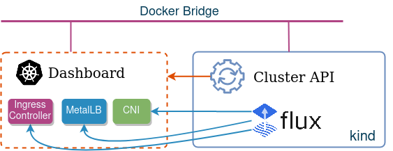
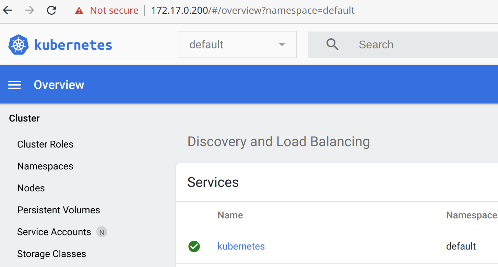

# Instructions how to use flux to bootstrap Cluster API workload clusters

Cluster API workload clusters are deployed with very minimal configuration (only DNS addon is included). However, every cluster requires a number of extra addons to be installed before it can become useful, e.g.:

* CNI plugin
* Load-balancer controller
* Ingress controller
* Monitoring and observability tools
* Security hardening 

This repository contains a demo of how to use [flux](https://fluxcd.io/) too boostrap a test workload cluster with Calico CNI, MetalLB, NGINX Ingress Controller and a Kubernetes Dashboard.



## Environment setup

To test things locally, we first need to create a test workload cluster. The following steps will setup a test [CAPD](https://github.com/kubernetes-sigs/cluster-api-provider-docker/) cluster.

1. Create a test "Management" kind cluster

```
make kind-start
```

2. Install CAPI+CAPD controllers

```
make capi
```

3. Create a test "Workload" CAPD cluster

```
make capd
```

At this stage the nodes of the CAPD cluster should be in `NOTREADY` state:

```
kubectl get secret/capd-kubeconfig -o jsonpath={.data.value} \
 | base64 --decode  > ./capd.kubeconfig
KUBECONFIG=./capd.kubeconfig kubectl get nodes
```

## Install flux to manage the remote cluster 

```
helm repo add fluxcd https://charts.fluxcd.io
kubectl apply -f ./flux-role.yaml
helm install --namespace default -f flux-values.yml flux-capd fluxcd/flux
```

## Test connectivity to the Kubernetes Dashboard

Find out what IP has been assigned to the ingress:

```
ip=$(KUBECONFIG=./capd.kubeconfig kubectl get ingress -n monitoring dashboard-kubernetes-dashboard -ojson  | jq -r '.status.loadBalancer.ingress[0].ip')
echo $ip
172.17.0.200
```

Extract token for the admin user:

```
user=$(KUBECONFIG=./capd.kubeconfig kubectl get secret -n monitoring | grep admin-user | awk '{print $1}')
secret=$(KUBECONFIG=./capd.kubeconfig kubectl -n monitoring get secret $user -ojson | jq -r '.data.token')
echo $secret | base64 -d
eyJhbGciOiJS...
```

Use the above secret to authenticate with the k8s dashboard:


